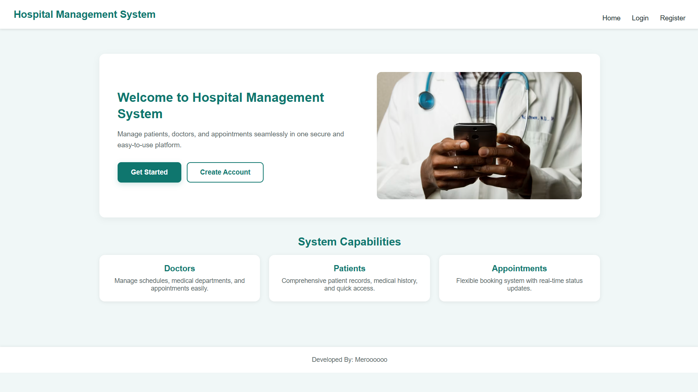
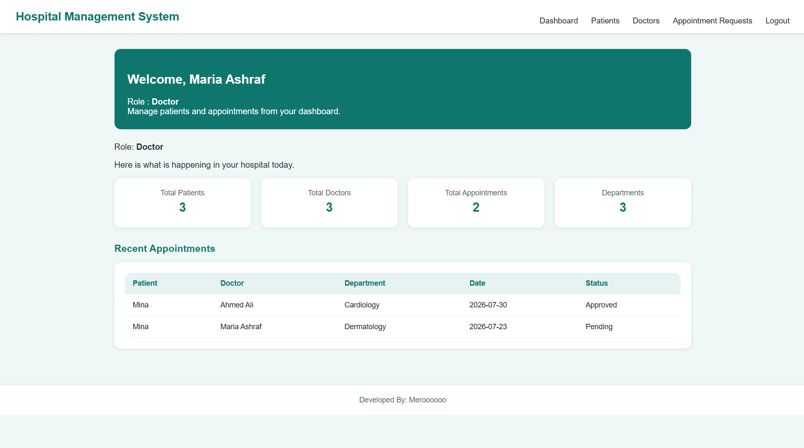
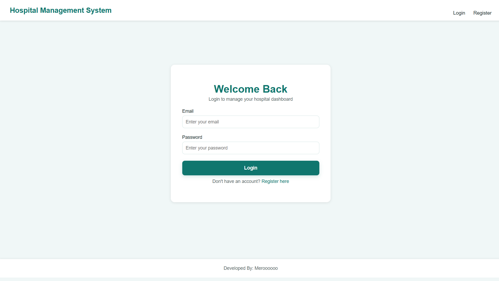
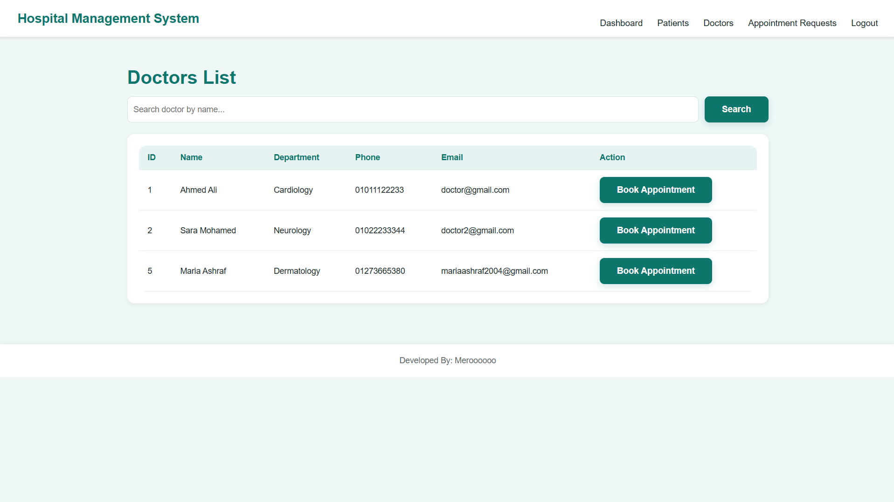
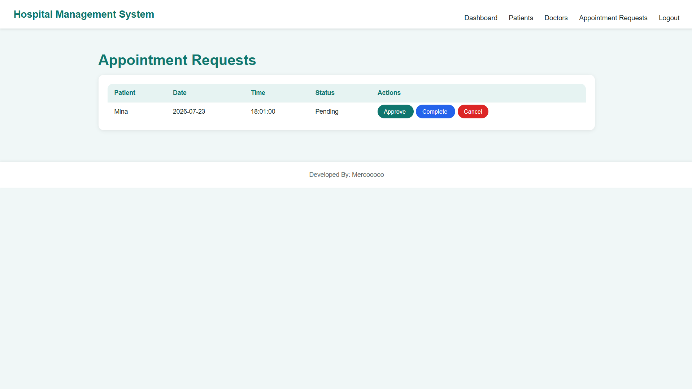

# Hospital Management System (HMS) - Native PHP Web Application

Hospital Management System is a full-stack web application built using **Native PHP**, **MySQL**, **HTML5**, and **CSS3**.

The system helps healthcare administrators and clinic staff manage daily operations such as patient management, doctor schedules, appointment booking, and system activity tracking through a clean and user-friendly interface.

---

## Project Preview

The application features a modern welcome landing page along with a secure authentication system where authorized users can login or create an account.



After logging in, users are redirected to the main dashboard providing a comprehensive overview of hospital activities and key metrics.



---

## Project Overview

This project simulates a real-world Hospital Management System designed to streamline medical administration.

The system allows staff to handle primary healthcare data seamlessly from a single platform. It includes user authentication, full CRUD operations, database relationships, and real-time appointment tracking.

---

## Technologies Used

- **Backend**: Native PHP
- **Database**: MySQL / MariaDB
- **Frontend**: HTML5, CSS3, Font Awesome Icons
- **Server**: Apache (XAMPP / WAMP)
- **Architecture**: Procedural Modular Architecture

---

## Main Features

### 1. Landing Page & Navigation
A responsive landing page highlighting system capabilities and quick access buttons for seamless navigation.


---

### 2. Authentication System
A secure authentication flow that protects sensitive patient and medical data:
- Register new user accounts
- Secure Login and Session Management
- Logout functionality



---

### 3. Admin & Medical Dashboard
Provides quick access to system activity, stats, and real-time operational summaries.


---

### 4. Patient Management
Complete patient management system to maintain medical history and personal profiles:
- Add, update, and manage patient records
- View contact details and history
- Assign patients to specific doctors or appointments


---

### 5. Doctor Management
Manage hospital medical team and staff details:
- Add and manage doctor profiles
- Assign specializations and working schedules
- Track appointments per doctor



---

### 6. Appointment Booking System
Streamlined scheduling system for booking and managing patient visits:
- Book new appointments
- View doctor availability
- Manage appointment status (Pending, Confirmed, Completed)



---

## Project Architecture

```text
HMS/
│
├── config/
│   ├── auth.php
│   └── database.php
│
├── assets/
│   └── css/
│       └── style.css
│
├── screenshots/
│   ├── home.png
│   ├── login.png
│   ├── register.png
│   ├── dashboard.png
│   ├── patients.png
│   ├── doctors.png
│   └── appointments.png
│
├── appointments.php
├── book-appointment.php
├── dashboard.php
├── doctor-appointments.php
├── doctors.php
├── index.php
├── login.php
├── logout.php
├── patients.php
├── profile.php
├── register.php
├── .gitignore
└── README.md

```

---

## Author

**Maria Ashraf Haleem**

Software Engineering Student

Faculty of Computers and Artificial Intelligence

Interested in Artificial Intelligence, Machine Learning, Intelligent Systems, and Software Engineering.